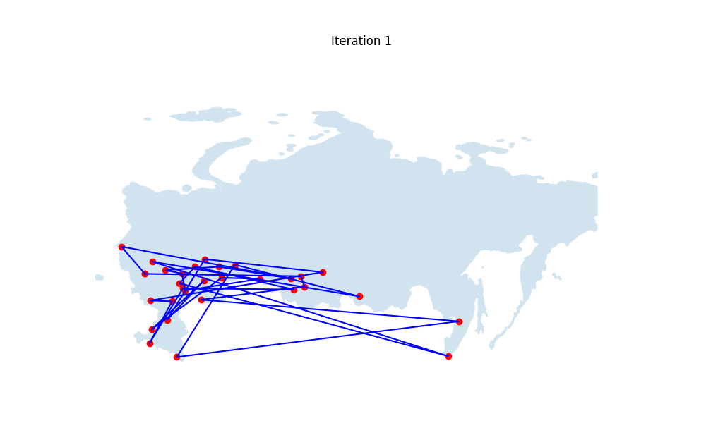

# Simulated annealing
## STDSR-2023-Assignment 2
This is a simple implementation of the simulated annealing algorithm. It is used to solve the traveling salesman problem.

## Result
The result of the algorithm is a list of cities in the order they should be visited. The order is the optimal solution to the traveling salesman problem.

## Animation

